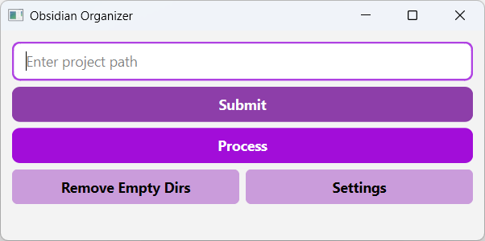

# Obsidian Organizer

A small PySide6 utility that tidies an Obsidian vault: it scans Markdown files for embedded attachments, copies the used files into a dedicated attachments folder beside each note, prunes unused assets, and removes empty directories left behind.




## Features
- Detects attachments referenced with Obsidian-style embeds (`![[filename|width]]`), including `.excalidraw.md` files.
- Copies in-use attachments into a configurable folder (defaults to `attachments`) that sits next to each Markdown file.
- Removes attachments that are not referenced anywhere in the project and cleans up empty directories (skips hidden folders).
- Simple GUI with buttons to load a vault, run the cleanup, and adjust the attachment folder name.

## Requirements
- Python 3.11+
- Dependencies: `PySide6`

## Setup
```bash
# from the repo root
python -m venv .venv
.venv\Scripts\activate  # or source .venv/bin/activate on macOS/Linux

# install dependencies (pick one)
pip install pyside6
# or, if you use uv and want to honor uv.lock:
# uv sync
```

## Run the app
```bash
python main.py
```

In the window:
1) Enter the path to your Obsidian vault (or any folder containing Markdown files).  
2) Optional: click **Settings** to change the attachment folder name (default: `attachments`).  
3) Click **Submit** to load the project; the app reports how many Markdown files and attachments were found.  
4) Click **Process** to copy referenced attachments into the attachment folder, remove unreferenced attachments, and clean empty directories.  
5) **Remove Empty Dirs** runs an additional cleanup pass to clear out stray empty folders.

> The styles in `style/window.qss` and `style/settingWindow.qss` are loaded at runtime; keep the `style/` folder next to `main.py`.

## Programmatic use
You can call the processing logic directly without the GUI:
```python
from utils import Process

p = Process(r"path\\to\\vault", attachments_dir_name="attachments")
p.copy_attachments()              # copy referenced attachments next to each note
p.remove_unused_attachments()     # delete unreferenced attachments
p.remove_empty_directories()      # clear empty folders
```

## Notes and cautions
- The cleanup is destructive for unreferenced attachments; make a backup or test on a copy first (see `resources/test/` for sample data).
- Hidden directories are skipped; if you need to protect other paths (e.g., `.git`, `.obsidian`), add similar guards in `Process.remove_empty_directories`.
- Attachment detection relies on Obsidian embed syntax; plain text references will not be picked up.
